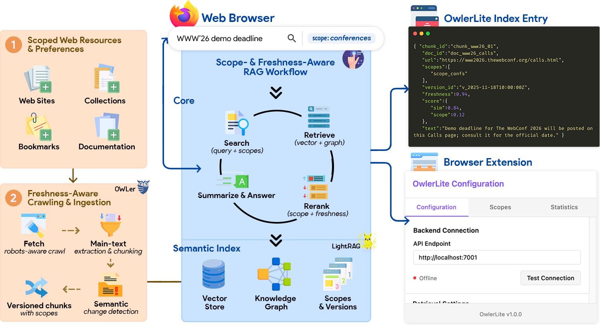
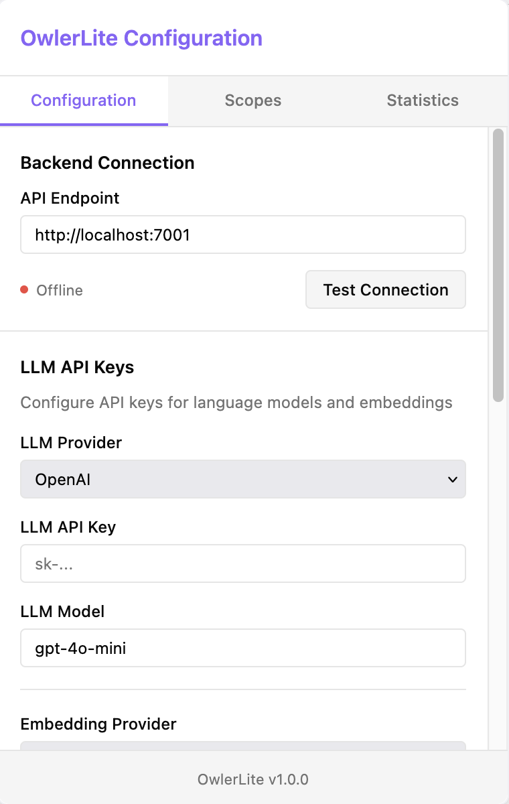
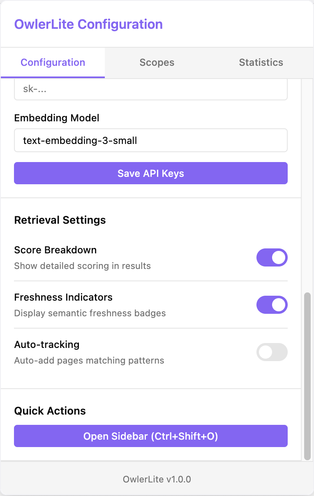
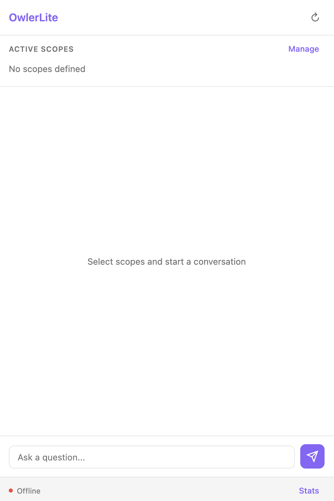

# OwlerLite: Scope- and Freshness-Aware Browser-Based RAG



[](LICENSE)
[](https://arxiv.org)

This repository contains the implementation of **OwlerLite: Scope- and Freshness-Aware Web Retrieval for LLM Assistants**.

---

## Abstract

> Browser-based language models often use retrieval-augmented generation (RAG) but typically rely on fixed, outdated indices that give users no control over which sources are consulted. This can lead to answers that mix trusted and untrusted content or draw on stale information. We present OwlerLite, a browser-based RAG system that makes user-defined scopes and data freshness central to retrieval. Users define reusable scopes-sets of web pages or sources-and select them when querying. A freshness-aware crawler monitors live pages, uses a semantic change detector to identify meaningful updates, and selectively re-indexes changed content. OwlerLite integrates text relevance, scope choice, and recency into a unified retrieval model. Implemented as a browser extension, it represents a step toward more controllable and trustworthy web assistants.

**Keywords**: *Retrieval-Augmented Generation • Browser Extensions • Semantic Freshness • Knowledge Graph Retrieval • Explainable Information Retrieval*

---

A browser-based RAG system that enables persistent, scoped retrieval over user-defined web collections with semantic freshness tracking and transparent provenance.

## Overview

OwlerLite is a browser extension and backend service that provides scope-aware retrieval-augmented generation over curated web resources. Unlike traditional RAG systems that operate over static indices or web-search-enabled assistants that rely on ephemeral queries, OwlerLite maintains persistent, user-defined scopes and tracks semantic changes at the chunk level.

The system builds on concepts from OWLer, a collaborative open web crawler, but targets a different layer: persistent, scoped, and versioned corpora for browser-based RAG rather than large-scale general-purpose crawling.

<p align="center">
  
  
  
</p>

<p align="center"><em>OwlerLite browser extension: Configuration, Scope Management, and Query Interface</em></p>

## Key Features

### Scope-Aware Retrieval
- **Explicit scope definition**: Users create named scopes corresponding to sets of web resources
- **Multi-scope queries**: Select one or more scopes at query time for focused retrieval
- **Scope fidelity**: Retrieval prioritizes passages from selected scopes
- **Reusable configurations**: Scopes persist across sessions and can be exported/imported

### Semantic Freshness Tracking
- **Chunk-level change detection**: SimHash fingerprints detect meaningful content changes
- **Selective re-ingestion**: Only semantically updated chunks are re-indexed
- **Freshness signals**: Retrieval scores incorporate recency and update patterns
- **Version lineage**: Track how content evolves over time with diff views

### Transparent Provenance
- **Score breakdowns**: See semantic similarity, graph evidence, scope priors, and freshness contributions
- **Scope badges**: Visual indicators of which collections contain each result
- **Version information**: Timestamps and version identifiers for retrieved passages
- **Explanation interface**: Detailed provenance for every answer

### Privacy-Preserving Architecture
- **Local processing**: All data remains on your infrastructure
- **Self-hosted backend**: Complete control over crawling, indexing, and retrieval
- **No external dependencies**: Optional cloud LLM integration with user-provided keys

## Architecture

The system consists of three main subsystems as described in the research:

### 1. Freshness-Aware Crawler and Ingester
Located in `services/crawler/`, this component:
- Monitors web resources associated with user-defined scopes
- Extracts main content using DOM-based readability heuristics
- Computes 64-bit SimHash signatures over 5-gram shingles for each chunk
- Detects semantic changes by comparing signatures across versions
- Selectively re-ingests only chunks that cross similarity thresholds

### 2. LightRAG-Based Retrieval Backend
Implemented across `services/orchestrator/` and `services/lightrag/`, featuring:
- Vector store for dense passage embeddings
- Knowledge graph with entities and relations
- Scope and version metadata annotation
- Hybrid scoring function combining semantic similarity, graph evidence, scope priors, and freshness
- Filter-based candidate generation restricted to selected scopes

### 3. Browser Extension Frontend
Powered by `services/extension/`, providing:
- Sidebar interface for conversational queries
- Scope management (create, edit, delete, export/import)
- Configuration interface for API keys and backend settings
- Statistics dashboard showing crawl status and freshness metrics
- Real-time backend connection monitoring

## Installation

### Prerequisites
- Docker and Docker Compose
- Go 1.22+ (for local development)
- Modern web browser (Chrome, Firefox, or Edge)
- OpenAI API key (or compatible LLM endpoint)

### Setup

1. **Clone the repository**
   ```bash
   git clone https://github.com/your-org/owlerlite
   cd owlerlite
   ```

2. **Configure LightRAG**
   
   Edit `services/lightrag/.env.example` with your API credentials:
   ```bash
   LLM_BINDING_HOST=https://api.openai.com/v1
   LLM_BINDING_API_KEY=your-openai-api-key
   LLM_MODEL=gpt-4o-mini
   
   EMBEDDING_BINDING_HOST=https://api.openai.com/v1
   EMBEDDING_BINDING_API_KEY=your-openai-api-key
   EMBEDDING_MODEL=text-embedding-3-small
   EMBEDDING_DIM=1536
   ```

3. **Build and start backend services**
   ```bash
   make setup  # Generate protobuf files and dependencies
   make build  # Build all Docker images
   make up     # Start all services
   ```

4. **Install browser extension**
   
   Navigate to `services/extension/`:
   
   **Firefox:**
   - Open `about:debugging#/runtime/this-firefox`
   - Click "Load Temporary Add-on"
   - Select `services/extension/dist/manifest.json`
   
   **Chrome/Edge:**
   - Navigate to `chrome://extensions/` or `edge://extensions/`
   - Enable "Developer mode"
   - Click "Load unpacked"
   - Select `services/extension/dist` folder

5. **Configure the extension**
   - Click the OwlerLite extension icon
   - Enter the API endpoint: `http://localhost:7001`
   - Add your LLM API keys (same as backend configuration)
   - Test the connection to verify backend availability

## Usage

### Basic Operation

1. **Define scopes**: Click the extension icon → Create new scope → Add URL patterns or individual pages
2. **Add resources**: Use the "Add Page" feature to include the current browser tab in a scope
3. **Query with scopes**: Open sidebar (Ctrl+Shift+O) → Select scopes → Type your question
4. **Review results**: See ranked passages with score breakdowns and freshness indicators
5. **Track changes**: Monitor semantic updates through version information and diffs

### Advanced Features

#### Scope Management
- Create scopes with URL pattern matching (e.g., `https://docs.python.org/*`)
- Enable auto-tracking to automatically add visited pages to matching scopes
- Export/import scope configurations for backup or sharing
- View scope statistics: pattern count, indexed pages, freshness status

#### Conversational Interface
- Chat-like sidebar interface for natural interaction
- Results appear inline within the conversation
- Context-aware follow-up questions
- Expandable score breakdowns and explanations

#### System Monitoring
- Real-time crawl queue status
- Active crawls and pending updates count
- Recent activity log
- Freshness overview per scope
- Backend connection health indicator

## Technical Implementation

### Core Technologies
- **Backend**: Go 1.22+, Docker, gRPC, URLFrontier protocol
- **Frontend**: TypeScript, Web Extensions API (Manifest V3)
- **RAG Framework**: LightRAG (vector + knowledge graph)
- **Semantic Hashing**: SimHash with 5-gram shingles
- **Storage**: Vector store and graph database via LightRAG

### Semantic Freshness Model

The system implements chunk-level freshness detection:

**Change Detection**: For each chunk pair (c_old, c_new):
```
σ(c_old, c_new) = 1 - Hamming(s(c_old), s(c_new)) / 64
```

Where s(c) is the 64-bit SimHash signature.

**Thresholds**:
- τ₁ = 0.98: Chunks with σ > τ₁ are unchanged
- τ₂ = 0.90: Chunks with σ < τ₂ are semantically updated

### Retrieval Objective

Scope- and freshness-aware scoring:
```
h(q,p) = α·sim_vec(q,p) + (1-α)·score_graph(q,p) + β·log g(p; S_q) + δ·fresh(p)
```

Where:
- `sim_vec`: Semantic similarity (vector search)
- `score_graph`: Graph-based evidence (entity/relation paths)
- `g(p; S_q)`: Scope prior (1.0 if p in selected scopes, γ otherwise)
- `fresh(p)`: Freshness signal (exponential decay from last update)

### Privacy Engineering
- Self-hosted infrastructure: all components run locally or on user-controlled servers
- No external data transmission: user data never leaves configured boundaries
- Configurable API endpoints: choose cloud or local LLM providers
- Transparent operation: full visibility into crawling, indexing, and retrieval

## Development

### Project Structure
```
owlerlite/
├── services/
│   ├── api/                  # REST API service
│   │   ├── main.py           # API service entry point
│   │   ├── requirements.txt  # Python dependencies
│   │   └── Dockerfile
│   ├── crawler/              # Web content fetching and change detection
│   │   ├── main.go           # Crawler service entry point
│   │   └── Dockerfile
│   ├── frontier/             # URL queue management (URLFrontier protocol)
│   │   ├── main.go           # Frontier service entry point
│   │   ├── proto/            # gRPC protocol definitions
│   │   └── Dockerfile
│   ├── orchestrator/         # Query routing and scope management
│   │   ├── main.go           # Orchestrator service entry point
│   │   └── Dockerfile
│   ├── lightrag/             # RAG backend (vector + graph)
│   │   └── Dockerfile
│   ├── extension/            # Browser extension
│   │   ├── src/
│   │   │   ├── sidebar.*     # Main query interface
│   │   │   ├── popup.*       # Configuration interface
│   │   │   ├── background.js # Extension orchestration
│   │   │   └── manifest.json # Extension metadata
│   │   ├── build.sh          # Build script
│   │   └── dist/             # Built extension
│   └── ui/                   # Web UI (Next.js)
│       └── app/
├── Makefile                  # Build and deployment automation
├── docker-compose.yml        # Service orchestration
└── README.md
```

## License

See project documentation for license information.

## Acknowledgments

This work builds on OWLer, developed in the OpenWebSearch.eu project, and LightRAG from the HKU Data Intelligence Lab.
