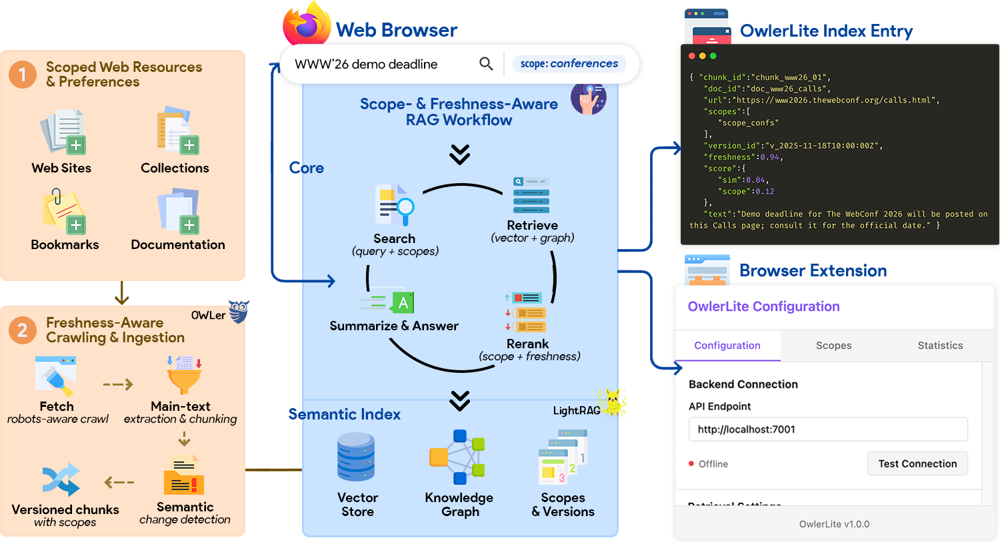
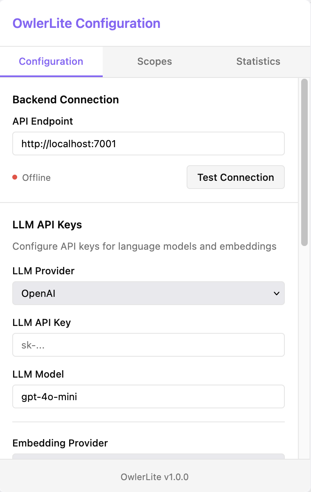
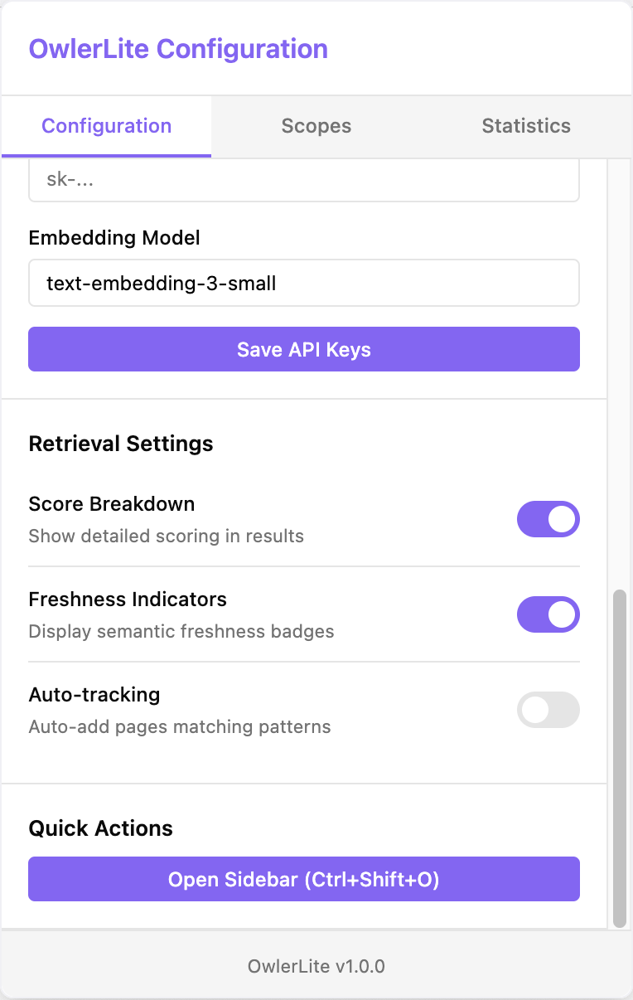
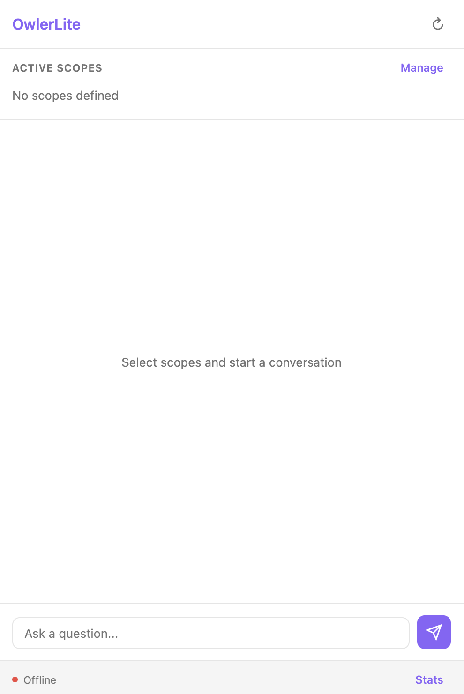

<div align="center">

# OwlerLite

### Scope- and Freshness-Aware Web Retrieval for LLM Assistants

*A browser-based RAG system where you choose which sources an assistant can use, and a crawler keeps them up to date.*

[](https://doi.org/10.1145/3774905.3793140)
[](https://doi.org/10.1145/3774905.3793140)
[](LICENSE)
[](#installation)
[](#architecture)



**[Saber Zerhoudi](mailto:szerhoudi@acm.org), Michael Dinzinger, Michael Granitzer, Jelena Mitrović**
Published at **The ACM Web Conference 2026 (WWW Companion), Dubai** &nbsp;·&nbsp; pp. 216–220 &nbsp;·&nbsp; [Read the paper](https://doi.org/10.1145/3774905.3793140)

</div>

> **What is this?** Most browser RAG tools answer from a fixed index that you cannot control or refresh. OwlerLite is a browser extension with a self-hosted backend that lets you group web pages into named **scopes** and pick which scope each query uses. A crawler re-checks those pages, detects meaningful changes, and re-indexes them, so answers stay current.
>
> **Who is it for?** IR/RAG researchers studying controllable retrieval, and practitioners who want a trustworthy, self-hosted web assistant.

**Contents:** [Abstract](#abstract) · [Highlights](#highlights) · [Citation](#citation) · [Demo](#demo) · [Quick Start](#quick-start) · [Installation](#installation) · [Usage](#usage) · [Architecture](#architecture) · [Method](#method) · [Evaluation](#evaluation) · [Related Work](#related-work)

---

## Abstract

> Browser-based language models often use retrieval-augmented generation (RAG) but typically rely on fixed, outdated indices that give users no control over which sources are consulted. This can lead to answers that mix trusted and untrusted content or draw on stale information. We present **OwlerLite**, a browser-based RAG system that makes user-defined **scopes** and data **freshness** central to retrieval. Users define reusable scopes — sets of web pages or sources — and select them when querying. A freshness-aware crawler monitors live pages, uses a semantic change detector to identify meaningful updates, and selectively re-indexes changed content. OwlerLite integrates text relevance, scope choice, and recency into a unified retrieval model. Implemented as a browser extension, it represents a step toward more controllable and trustworthy web assistants.

**Keywords** &nbsp;·&nbsp; *Retrieval-Augmented Generation · Browser Extensions · Semantic Freshness · Knowledge Graph Retrieval · Explainable Information Retrieval*

---

## Highlights

- **Scope-exclusive retrieval:** answers come only from the collections you select, using an `@scope` syntax (for example, `@msmarco`).
- **Semantic freshness tracking:** a two-threshold SimHash check re-indexes only the chunks whose meaning changed, and skips the rest.
- **Unified scoring:** one retrieval score combines vector similarity, knowledge-graph evidence, scope priors, and recency.
- **Transparent provenance:** every result shows how much its semantic, graph, scope, and freshness components added to the score.
- **Self-hosted and private:** crawling, indexing, and retrieval all run on your own infrastructure.

---

## Citation

If you find OwlerLite useful in your research, please cite our WWW 2026 paper. You can also use the **"Cite this repository"** button in the sidebar (powered by [`CITATION.cff`](CITATION.cff)).

```bibtex
@inproceedings{Zerhoudi:2026:WWW,
  author    = {Saber Zerhoudi and Michael Dinzinger and Michael Granitzer and Jelena Mitrovic},
  title     = {OwlerLite: Scope- and Freshness-Aware Web Retrieval for {LLM} Assistants},
  booktitle = {Companion Proceedings of the {ACM} Web Conference 2026 (WWW Companion 2026),
               Dubai, United Arab Emirates, 29 June -- 3 July 2026},
  pages     = {216--220},
  publisher = {{ACM}},
  year      = {2026},
  url       = {https://doi.org/10.1145/3774905.3793140},
  doi       = {10.1145/3774905.3793140}
}
```

> **ACM Reference Format:** Saber Zerhoudi, Michael Dinzinger, Michael Granitzer, and Jelena Mitrović. 2026. OwlerLite: Scope- and Freshness-Aware Web Retrieval for LLM Assistants. In *Companion Proceedings of the ACM Web Conference 2026 (WWW Companion 2026)*. ACM, 216–220. https://doi.org/10.1145/3774905.3793140

---

## Demo

A recorded walkthrough that covers picking a model, selecting a scope, and running a query whose results come only from that scope:

<p align="center">
  <video src="https://github.com/user-attachments/assets/dc8f9606-59b1-41ab-81d7-d64867d699ff" width="80%" controls></video>
</p>

<p align="center">
  
  
  
</p>
<p align="center"><em>Configuration &nbsp;·&nbsp; Scope management &nbsp;·&nbsp; Query sidebar</em></p>

**Featured scope (`@msmarco`):** a freshly crawled partition of the 3.5M-URL [MS MARCO](https://microsoft.github.io/msmarco/) corpus, kept up to date with freshness tracking.

---

## Quick Start

```bash
git clone https://github.com/searchsim-org/www26-owlerlite && cd www26-owlerlite
cp services/lightrag/.env.example services/lightrag/.env   # add your LLM keys
make setup && make build && make up                        # backend on :7001, web UI on :3000
```

Then [load the browser extension](#installation) and point it at `http://localhost:7001`.

**Prerequisites:** Docker and Docker Compose · Go 1.22+ (for local development) · a modern browser (Chrome, Firefox, or Edge) · an OpenAI-compatible LLM key.

---

## Installation

<details>
<summary><b>1 · Configure the backend</b></summary>

Edit `services/lightrag/.env`:

```bash
LLM_BINDING_HOST=https://api.openai.com/v1
LLM_BINDING_API_KEY=your-openai-api-key
LLM_MODEL=gpt-4o-mini

EMBEDDING_BINDING_HOST=https://api.openai.com/v1
EMBEDDING_BINDING_API_KEY=your-openai-api-key
EMBEDDING_MODEL=text-embedding-3-small
EMBEDDING_DIM=1536
```
</details>

<details>
<summary><b>2 · Load the extension (Firefox / Chrome / Edge)</b></summary>

**Firefox:** open `about:debugging#/runtime/this-firefox`, click *Load Temporary Add-on*, and select `services/extension/dist/manifest.json`.

**Chrome / Edge:** open `chrome://extensions/` (or `edge://extensions/`), enable *Developer mode*, click *Load unpacked*, and select the `services/extension/dist` folder.
</details>

<details>
<summary><b>3 · Connect the extension</b></summary>

Click the OwlerLite icon, set the API endpoint to `http://localhost:7001`, add your LLM keys, and click *Test connection* to verify the backend is reachable.
</details>

---

## Usage

1. **Define a scope:** open the extension, choose *New scope*, and add URL patterns (for example, `https://docs.python.org/*`) or individual pages.
2. **Add resources:** *Add Page* includes the current browser tab. Turn on auto-tracking to capture matching pages as you browse.
3. **Query a scope:** open the sidebar (`Ctrl+Shift+O`), type your question, and name the scope with `@` (for example, `@msmarco what is the capital of France?`). Results come only from that scope.
4. **Inspect:** each result shows a score breakdown (semantic, graph, scope, freshness) with version and diff information.

<p align="center"></p>
<p align="center"><em>Querying with <code>@msmarco</code>: context drawn only from the selected collection.</em></p>

---

## Architecture

Three subsystems, mapping directly to the system described in the paper:

| Subsystem | Path | Role |
|-----------|------|------|
| **Freshness-aware crawler** | `services/crawler/` | Monitors scope URLs, extracts main content via DOM readability heuristics, computes a 64-bit SimHash per chunk, and selectively re-ingests only semantically changed chunks. |
| **LightRAG retrieval backend** | `services/orchestrator/`, `services/lightrag/` | Vector store plus knowledge graph, scope and version metadata, hybrid scoring, and scope-filtered candidate generation. |
| **Browser extension and Web UI** | `services/extension/`, `services/ui/` | Conversational sidebar, scope management, provenance and score views, and crawl/freshness dashboards. |

---

## Method

<details>
<summary><b>Semantic freshness: two-threshold classification</b></summary>

For each chunk pair, similarity is computed from 64-bit SimHash signatures `s(c)`:

```
σ(c_old, c_new) = 1 − Hamming(s(c_old), s(c_new)) / 64
```

- **τ₁ = 0.97 (Hamming ≤ 2):** σ ≥ τ₁ → unchanged, skip re-indexing.
- **τ₂ = 0.90 (Hamming ≥ 6):** σ ≤ τ₂ → semantically updated, always re-index.
- **Intermediate band [τ₂, τ₁]:** embedding-based SemDeDup decides.
</details>

<details>
<summary><b>Scope- and freshness-aware retrieval objective</b></summary>

```
h(q,p) = α·sim_vec(q,p) + (1−α)·score_graph(q,p) + β·log g(p; S_q) + δ·fresh(p)
```

- `sim_vec`: semantic similarity (vector search). `score_graph`: entity/relation path evidence.
- `g(p; S_q)`: scope prior (1.0 if p is in the selected scopes, γ otherwise). `fresh(p)`: exponential recency decay from the last update.
- **Default parameters:** α = 0.8, β = 0.2, δ = 0.15, γ = 0.1.
</details>

---

## Evaluation

The paper evaluates OwlerLite with the **TREC 2024 RAG** protocol, reporting **SF@k** (scope fidelity), **SL@k** (scope leakage), and **NDCG@10** (graded relevance), with synthetic scope clustering (k-means on document embeddings). See Section 4 of the [paper](https://doi.org/10.1145/3774905.3793140) for the full setup and results.

---

## Related Work

OwlerLite builds on prior systems and differs from them in specific ways:

- **[OWLer](https://openwebindex.eu/)** (OpenWebSearch.eu): a collaborative open web crawler. OwlerLite works at a different layer. It builds persistent, scoped, versioned collections for browser RAG instead of crawling the web at large scale.
- **[LightRAG](https://github.com/HKUDS/LightRAG)** (HKU Data Intelligence Lab): vector and knowledge-graph RAG. OwlerLite adds scope priors and freshness signals to its retrieval score.
- **TREC 2024 RAG track:** the evaluation protocol used in the paper.

Static-index RAG cannot refresh its sources, and web-search assistants discard their sources after each query. OwlerLite keeps user-defined scopes and tracks chunk-level changes over time.

---

## Acknowledgments

This work builds on **OWLer**, developed in the OpenWebSearch.eu project, and **LightRAG**, from the HKU Data Intelligence Lab.

## License

Released under the [MIT License](LICENSE).

<details>
<summary><b>Project structure</b></summary>

```
owlerlite/
├── services/
│   ├── api/            # REST API service (Python)
│   ├── crawler/        # Content fetching + SimHash change detection (Go)
│   ├── frontier/       # URL queue management (URLFrontier / gRPC, Go)
│   ├── orchestrator/   # Query routing + scope management (Go)
│   ├── lightrag/       # RAG backend (vector + graph)
│   ├── extension/      # Browser extension (Manifest V3, TypeScript)
│   └── ui/             # Web UI (Next.js)
├── Makefile            # Build and deployment automation
├── docker-compose.yml  # Service orchestration
└── CITATION.cff        # Machine-readable citation metadata
```
</details>
